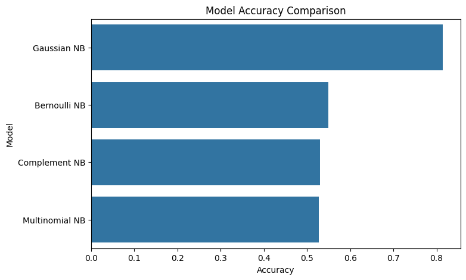
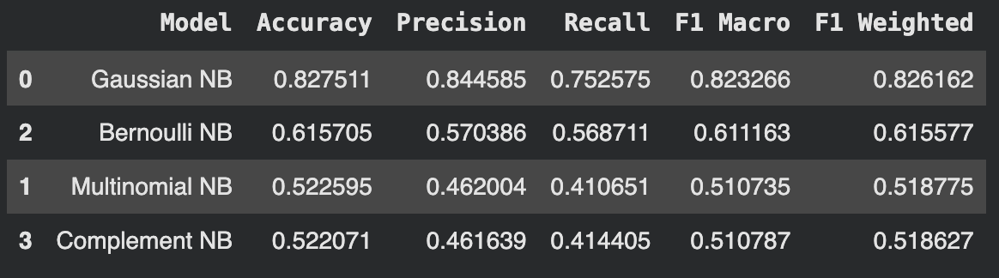
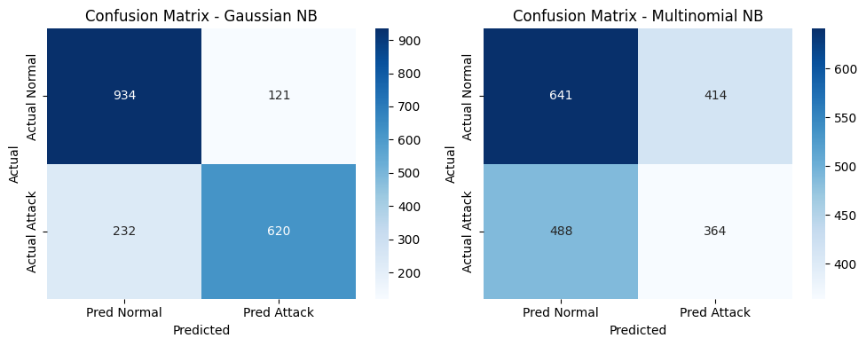
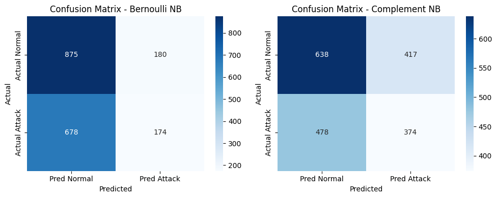
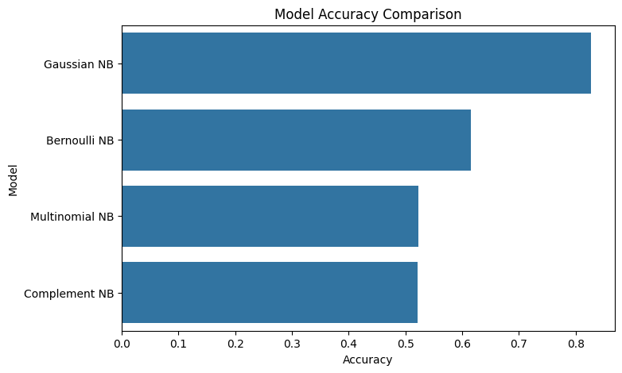
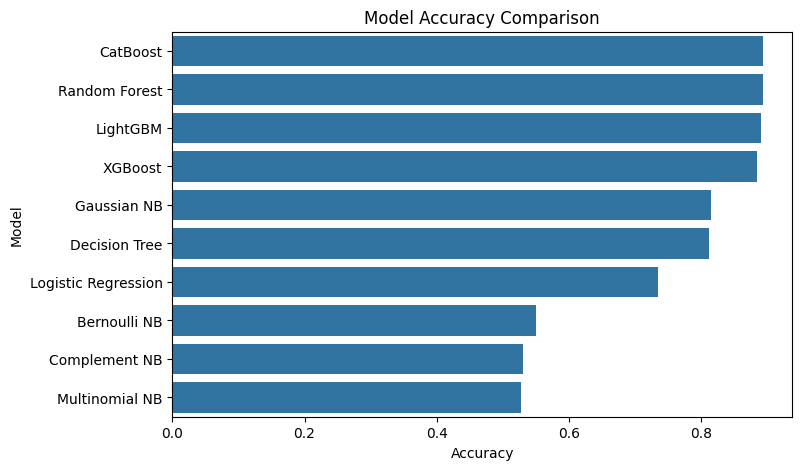

# Naive Bayes to Detect Cyber Attack

## Group 5:
### Team Members
| No | Name | NRP |
|---|---|---|
| 1 | Raynald Ramadhani Fachriansyah | 5025241020 |
| 2 | Ferdian Ardra Hafizhan | 5025241033 |
| 3 | Gilbran Mahdavikia Raja | 5025241134 |
| 4 | Afarrel Febryan Ghiffari Putra Andy | 5025241137 |

## Table of Contents

- [Bayes Theory](#bayes-theory)
- [Overview about the Dataset](#overview-about-the-dataset)
- [How Bayes Theory Implemented in the Naive Bayes Model](#how-bayes-theory-implemented-in-the-naive-bayes-model)
- [Naive Bayes Implementation for Cyber Attack Detection and Model Evaluation](#naive-bayes-implementation-for-cyber-attack-detection)

## Bayes Theory

Bayes' Theorem is a fundamental concept in probability theory that describes how the probability of a hypothesis can be updated when new evidence becomes available. It provides a mathematical framework for reasoning under uncertainty by combining prior knowledge with observed data.

The theorem shows how the posterior probability is computed by combining the prior belief with the likelihood of the observed evidence.

In many real-world problems, the denominator (P(B)) can be expanded using the law of total probability:


This allows Bayes' Theorem to be written as:


This formulation is particularly useful in classification problems where there are multiple possible classes.


## Overview about the Dataset


The dataset used in this project contains simulated cybersecurity session data that represents network activities and potential attack patterns.

link to dataset: https://www.kaggle.com/datasets/dnkumars/cybersecurity-intrusion-detection-dataset

Each row represents a network session and contains several features related to network behavior.

### Dataset Features

| Feature             | Type        | Description                                                                  |
| ------------------- | ----------- | ---------------------------------------------------------------------------- |
| network_packet_size | Numerical   | The size of packets transmitted during a network session.                    |
| protocol_type       | Categorical | The network protocol used during communication (TCP or UDP).                 |
| login_attempts      | Numerical   | Number of login attempts within the session.                                 |
| session_duration    | Numerical   | The total duration of the network session.                                   |
| encryption_used     | Categorical | Type of encryption used in the connection.                                   |
| ip_reputation_score | Numerical   | A score indicating the trustworthiness of the source IP address.             |
| failed_logins       | Numerical   | Number of failed authentication attempts.                                    |
| browser_type        | Categorical | Browser used in the session.                                                 |
| unusual_time_access | Binary      | Indicates whether the session occurred at an unusual time.                   |
| attack_detected     | Binary      | Target label indicating whether the session is classified as a cyber attack. |

Target label indicating whether the session is classified as a cyber attack.

### Dataset 5 First Row:

| session_id | network_packet_size | protocol_type | login_attempts | session_duration   | encryption_used | ip_reputation_score | failed_logins | browser_type | unusual_time_access | attack_detected                                     |
| ---------- | ------------------- | ------------- | -------------- | ------------------ | --------------- | ------------------- | ------------- | ------------ | ------------------- | --------------------------------------------------- |
| SID_00001  | 599                 | TCP           | 4              | 492.9832634426563  | DES             | 0.606818080396889   | 1             | Edge         | 0                   | <span style="color:red;font-weight:bold">1</span>   |
| SID_00002  | 472                 | TCP           | 3              | 1557.9964611204384 | DES             | 0.30156896759608937 | 0             | Firefox      | 0                   | <span style="color:green;font-weight:bold">0</span> |
| SID_00003  | 629                 | TCP           | 3              | 75.04426166420741  | DES             | 0.7391643279163831  | 2             | Chrome       | 0                   | <span style="color:red;font-weight:bold">1</span>   |
| SID_00004  | 804                 | UDP           | 4              | 601.2488351708328  | DES             | 0.12326717575248465 | 0             | Unknown      | 0                   | <span style="color:red;font-weight:bold">1</span>   |
| SID_00005  | 453                 | TCP           | 5              | 532.5408884201419  | AES             | 0.05487385674317035 | 1             | Firefox      | 0                   | <span style="color:green;font-weight:bold">0</span> |


## How Bayes Theory Implemented in the Naive Bayes Model

The Naive Bayes classifier applies Bayes' Theorem to perform classification tasks **by estimating the probability that a data instance belongs to a particular class based on its observed features**. In the context of cybersecurity intrusion detection, the model uses Bayes' Theorem to estimate the probability that a network session is an **attack** or **normal traffic**.

The classifier calculates the probability of each class given the observed features and then assigns the class with the highest probability.

The mathematical formulation used in Naive Bayes is:


Where:

| Term | Meaning |
|-----|-----|
| C | Class label (e.g., **Attack** or **Normal**) |
| X1, X2, ..., Xn | Observed features such as protocol type, encryption used, browser type, session duration, and packet counts |
| P(C  X1, ..., Xn) | Posterior probability: probability of class C given the observed features |
| P(C) | Prior probability of class C |
| P(X1, ..., Xn  C) | Likelihood: probability of observing the features if the class is C |
| P(X1, ..., Xn) | Evidence: overall probability of observing the features |

Since the denominator $P(X_1, ..., X_n)$ is constant for all classes, the classifier focuses on maximizing the numerator:

$$
P(C) * P(X1, X2, ..., Xn | C)
$$

---

### Implementation Steps in the Naive Bayes Model

In practice, the Naive Bayes classifier follows several steps during training and prediction.

#### 1. Calculate Prior Probabilities

The model first computes the **prior probability** of each class from the training dataset.

For example:

- $(P(Attack))$ = number of attack samples / total samples
- $(P(Normal))$ = number of normal samples / total samples

This represents how frequently each class appears in the data.

---

#### 2. Estimate Feature Likelihoods

Next, the model calculates the probability of each feature value occurring given a particular class.

Examples in a cybersecurity dataset include:

- Probability that a certain **protocol type** occurs during an attack
- Probability that a specific **browser type** appears in normal traffic
- Probability of **encryption usage** given an attack

The exact method used to compute these probabilities depends on the **variant of Naive Bayes** (Gaussian, Multinomial, Bernoulli, etc.).

---

#### 3. Compute Posterior Probabilities

When a new network session is observed, the model calculates the posterior probability for each class by multiplying the prior probability with the likelihood of the observed features.

This produces values such as:

- $(P(Attack \mid Observed\ Features))$
- $(P(Normal \mid Observed\ Features))$

---

#### 4. Choose the Most Probable Class

The classifier then compares the posterior probabilities and selects the class with the highest value.

If:

$$
P(Attack \mid X) > P(Normal \mid X)
$$

then the session is classified as a **cyber attack**. Otherwise, it is classified as **normal network traffic**.

---

### Application in Cyber Attack Detection

In intrusion detection systems, network sessions contain many measurable features such as:

- protocol type
- encryption usage
- browser type
- traffic volume
- session duration

The Naive Bayes model analyzes these features and estimates the probability that the observed behavior corresponds to a **malicious activity**.

Because Naive Bayes relies on probability distributions rather than complex optimization, it offers several advantages:

- Fast training and prediction
- Scalable to large datasets
- Works well with high-dimensional data
- Provides probabilistic interpretation of predictions

These characteristics make Naive Bayes a practical method for **cybersecurity intrusion detection**, where systems must analyze large amounts of network traffic and detect suspicious behavior efficiently.

## Naive Bayes Implementation for Cyber Attack Detection

This project implements several variants of the Naive Bayes algorithm to detect cyber attacks from network session data. The full pipeline consists of data exploration, preprocessing, model training, hyperparameter tuning, and evaluation.

The workflow follows a standard machine learning pipeline to ensure reliable and reproducible results.

---

### 1. Data Loading

The dataset is loaded using the pandas library and contains multiple features representing network session behavior.

```python
df = pd.read_csv("./cybersecurity_intrusion_data.csv")
```

Each row represents a single network session.

### 2. Exploratory Data Analysis (EDA)

Exploratory Data Analysis was performed to understand the dataset structure and identify patterns related to cyber attacks.

Several visualizations were used to explore the data:

- **Attack vs Normal Distribution** to observe class balance.
- **Protocol Type vs Attack** to analyze whether certain network protocols are more associated with attacks.
- **IP Reputation Score vs Attack** to examine whether suspicious IP addresses correlate with malicious sessions.
- **Correlation Heatmap** to identify relationships between numerical features.

These analyses help provide an initial understanding of the dataset before training machine learning models.

### 3. Data Preprocessing

Before applying the Naive Bayes models, several preprocessing steps were performed.

- #### Removing Irrelevant Features

- #### Handling Missing Values

  Missing values in the `encryption_used` feature were replaced with the category `"Unknown"`.

- #### Encoding Categorical Features

  Since machine learning models require numerical input, categorical features were converted into numerical values using Label Encoding.

After preprocessing, the dataset is ready to be used for training Naive Bayes models.

#### Feature and Target Separation

The dataset is split into input features and the target variable.

```python
X = df.drop("attack_detected", axis=1)
y = df["attack_detected"]
```

- **X** contains all input features
- **y** represents the target label indicating whether the session is a cyber attack

### 5. Cross Validation using Stratified K-Fold

Instead of using a single train test split, the project uses Stratified K-Fold cross validation.

```python
skf = StratifiedKFold(n_splits=5, shuffle=True, random_state=42)
```

Stratified K-Fold ensures that each fold maintains the same class distribution as the original dataset.

### 6. Naive Bayes Models

Several variants of the Naive Bayes algorithm are implemented and compared in this project.

```python
models = {
    "Gaussian NB": GaussianNB(),
    "Multinomial NB": MultinomialNB(),
    "Bernoulli NB": BernoulliNB(),
    "Complement NB": ComplementNB()
}
```

Naive Bayes is a probabilistic classification algorithm based on **Bayes' Theorem** with a strong assumption that all features are **conditionally independent given the class label**.

#### Bayes Theorem

Bayes' Theorem is a fundamental principle in probability theory that describes how to update the probability of a hypothesis based on new evidence.

In the context of machine learning classification, Bayes' Theorem is used to calculate the probability that a data instance belongs to a particular class given its observed features.

The general formula of Bayes' Theorem is:


Source: https://www.sciencedirect.com/topics/engineering/bayes-theorem

Where:

- `y` = class label (Attack or Normal)
- `x` = feature vector containing all observed features
- `P(y | x)` = **posterior probability**, the probability that a session belongs to class `y` given the observed features `x`
- `P(x | y)` = **likelihood**, the probability of observing the features `x` if the class is `y`
- `P(y)` = **prior probability**, the initial probability of class `y` occurring in the dataset
- `P(x)` = **evidence**, the probability of observing the feature vector `x`

The goal of a classifier is to determine which class has the highest posterior probability.

Since `P(x)` is the same for all classes, it does not affect the comparison between classes. Therefore the equation can be simplified to:

```
P(y | X) ∝ P(y) * Π P(x_i | y)
```

This means that the posterior probability is proportional to the prior probability multiplied by the likelihood of each feature.

The Naive Bayes classifier then predicts the class with the highest probability using the following rule:

```
ŷ = argmax P(y) * Π P(x_i | y)
```

In other words, the model calculates the probability of each class given the observed features and selects the class with the maximum probability.

In the context of cyber attack detection, the model estimates the probability that a network session is an **attack** or **normal activity** based on features such as packet size, login attempts, session duration, and IP reputation score.

#### Prediction Probabilities in Naive Bayes

Naive Bayes is a **probabilistic classifier**, meaning that instead of only predicting a class label, the model also estimates the **probability that a data instance belongs to each possible class**.

Using `predict_proba()`, the model returns the posterior probability for each class.

Example output from this training:


Where:

- **Prob_Normal** represents the probability that the session belongs to the **Normal** class.
- **Prob_Attack** represents the probability that the session belongs to the **Attack** class.

The predicted class corresponds to the class with the **highest probability value**.

---

#### Relationship with Naive Bayes

In general, Naive Bayes calculates the probability of each class using Bayes' Theorem:

```
P(y | X) ∝ P(y) * Π P(x_i | y)
```

Where:

- `P(y | X)` = posterior probability of class `y` given the observed features `X`
- `P(y)` = prior probability of class `y`
- `P(x_i | y)` = likelihood of feature `x_i` given class `y`
- `Π` = product of probabilities for all features

The algorithm computes this value for **each possible class**.

For example:

```
P(Attack | X)
P(Normal | X)
```

The model then compares the probabilities and selects the class with the highest value:

```
ŷ = argmax P(y) * Π P(x_i | y)
```

---

#### From Posterior Probability to `predict_proba()`

The raw posterior probabilities calculated by Naive Bayes are normalized so that the sum of probabilities across all classes equals 1:

```
P(Normal | X) + P(Attack | X) = 1
```

These normalized probabilities are exactly what the `predict_proba()` function returns.

For example:

```
Prob_Normal = 0.64
Prob_Attack = 0.36
```

This means that the model estimates a **64% probability that the session is normal traffic** and a **36% probability that it is an attack**.

---

#### Interpretation in Cyber Attack Detection

In the context of this project, these probabilities represent how confident the model is when classifying a network session.

For example:

```
Prob_Normal = 0.023
Prob_Attack = 0.977
```

This indicates that the model strongly believes the session corresponds to an **attack**.

These probability outputs are useful for:

- understanding the model's confidence in its predictions
- analyzing misclassified samples
- adjusting classification thresholds
- constructing ROC and precision–recall curves

Therefore, probability outputs provide deeper insight into how the Naive Bayes classifier evaluates each network session.

#### Naive Bayes Models in Scikit-Learn

| Model                       | Feature Assumption                                           | Likelihood Formula                                       | Key Parameters                                                                                                                               | Suitable Data                                                                                          |
| --------------------------- | ------------------------------------------------------------ | -------------------------------------------------------- | -------------------------------------------------------------------------------------------------------------------------------------------- | ------------------------------------------------------------------------------------------------------ |
| **Gaussian Naive Bayes**    | Features follow a normal (Gaussian) distribution             | `P(x_i \| C) = (1 / √(2πσ²)) * exp(-(x_i - μ)² / (2σ²))` | μ = mean of feature for class C<br>σ² = variance of feature for class C                                                                      | Continuous numerical features such as `network_packet_size`, `session_duration`, `ip_reputation_score` |
| **Multinomial Naive Bayes** | Features represent discrete counts                           | `P(x_i \| C) = (N_ic + α) / (N_c + αn)`                  | N*ic = count of feature \_i* in class C<br>N_c = total feature count in class C<br>n = number of features<br>α = Laplace smoothing parameter | Count-based features such as word frequencies in text classification                                   |
| **Bernoulli Naive Bayes**   | Features are binary (0 or 1) variables                       | `P(x_i \| C) = p_ic^(x_i) * (1 - p_ic)^(1-x_i)`          | x*i ∈ {0,1}<br>p_ic = probability that feature \_i* appears in class C                                                                       | Binary features such as presence/absence indicators                                                    |
| **Complement Naive Bayes**  | Extension of Multinomial NB designed for imbalanced datasets | `w_ci = log((N_ci + α) / (Σ N_cj + αn))`                 | N*ci = count of feature \_i* in complement class<br>n = number of features<br>α = smoothing parameter                                        | Imbalanced classification problems such as spam filtering or intrusion detection                       |

In this project, these variants are compared to determine which Naive Bayes model performs best for detecting cyber attacks in network session data.

### 7. Model Training

Each Naive Bayes model is trained using Stratified K-Fold cross validation.

For each fold:

1. Training data is used to fit the model
2. The model predicts labels on the validation fold
3. Evaluation metrics are computed

Example training step:

```python
model.fit(X_train, y_train)
y_pred = model.predict(X_test)
```

This process is repeated for all folds to obtain stable performance metrics.

### 8. Model Evaluation





Model performance is evaluated using several classification metrics derived from the **confusion matrix**.

| Term                    | Description                                       |
| ----------------------- | ------------------------------------------------- |
| **True Positive (TP)**  | Attack sessions correctly classified as attacks   |
| **True Negative (TN)**  | Normal sessions correctly classified as normal    |
| **False Positive (FP)** | Normal sessions incorrectly classified as attacks |
| **False Negative (FN)** | Attack sessions incorrectly classified as normal  |

#### Accuracy

Accuracy measures the overall correctness of the model.

```
Accuracy = (TP + TN) / (TP + TN + FP + FN)
```

It represents the proportion of correctly classified instances among all predictions.

#### Precision

Precision measures how many predicted attacks are actually attacks.

```
Precision = TP / (TP + FP)
```

High precision means the model produces fewer **false alarms**.

#### Recall

Recall measures how many real attacks were correctly detected.

```
Recall = TP / (TP + FN)
```

High recall indicates that the model successfully detects most attacks.

#### F1 Score

The F1 score is the harmonic mean of precision and recall.

```
F1 Score = 2 * (Precision * Recall) / (Precision + Recall)
```

It can also be written using confusion matrix values:

```
F1 Score = 2TP / (2TP + FP + FN)
```

The F1 score is particularly useful when dealing with **imbalanced datasets**, as it balances precision and recall.

The results from each fold are averaged to produce final metrics.

### 9. Confusion Matrix

Confusion matrices are used to visualize model prediction performance.

Heatmaps are used to visualize the confusion matrix for each model.




### 10. Hyperparameter Tuning

Hyperparameter tuning is applied using GridSearchCV to find optimal parameters for Naive Bayes models.

Example tuning for Gaussian Naive Bayes:

```python
param_grid = {
    "var_smoothing": np.logspace(-12, -3, 10)
}

grid_search = GridSearchCV(
    estimator=GaussianNB(),
    param_grid=param_grid,
    cv=skf,
    scoring="accuracy",
    n_jobs=-1
)
```

#### Model Accuracy after Hyperparameter Tuning



The best model configuration is selected based on cross validation accuracy.

### 11. Compare to other models

To evaluate the effectiveness of Naive Bayes, the results are compared with several other machine learning algorithms.

These include:

- Logistic Regression
- K-Nearest Neighbors
- Decision Tree
- Random Forest
- Support Vector Machine
- Boosting models such as XGBoost, LightGBM, and CatBoost

The performance of each model is compared using bar chart visualizations.



The performance of Naive Bayes models was compared with several other machine learning algorithms, including tree-based models, linear models, and gradient boosting models.

Based on the evaluation results, boosting algorithms such as **CatBoost, Random Forest, LightGBM, and XGBoost** achieved the highest accuracy. These models are known for their strong performance on tabular datasets because they can capture complex feature interactions and nonlinear relationships.

Among the Naive Bayes variants, **Gaussian Naive Bayes** achieved the best performance. This is expected because most features in the dataset are continuous numerical variables such as packet size, session duration, and IP reputation score, which align well with the Gaussian distribution assumption.

Other Naive Bayes variants such as **Multinomial, Bernoulli, and Complement Naive Bayes** performed lower in comparison. These models are typically more suitable for text classification or binary feature representations rather than continuous tabular data.

Despite having lower accuracy compared to boosting models, Naive Bayes still provides several advantages:

- Very fast training and prediction
- Simple probabilistic interpretation
- Strong baseline model for classification tasks

Therefore, Naive Bayes can serve as an efficient baseline model for cyber attack detection, while more complex models such as boosting algorithms can be used to achieve higher predictive performance.
